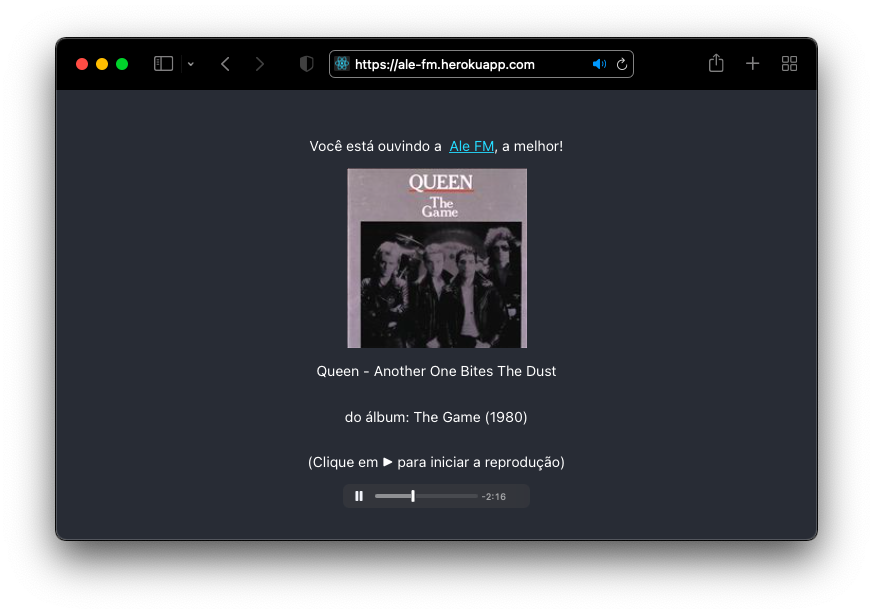

# Ale FM

## 🚀 Projeto
Uma rádio web tocando minhas músicas preferidas, 24h por dia!

    

## ▶️ Play!:
Confira em [https://ale-fm.herokuapp.com](https://ale-fm.herokuapp.com)

## 🛠️ Tecnologias
- [Node.js](https://nodejs.org/en/)
- [React](https://reactjs.org)
- [TypeScript](https://www.typescriptlang.org/)

## 🧊 Cool features:
- Uma função carrega os nomes de todas as musicas da minha pasta do Dropbox, montando uma variável 'playlist' com os links dos arquivos;
- A playlist é embaralhada 1x por dia. Tenha sempre uma programação variada!
- A hora do dia define o ponto da playlist que irá começar a tocar (ex: começou a ouvir as seis da tarde? Já passou 75% das músicas!)
- Por fim, uma API busca as informações do álbum da música atual para exibir nomes, datas, e arte de capa!
